# Tools review — candidate additions from `marinebon` & `noaa-onms`

_Compiled 2026-06-23. A working document for evaluating new entries for the MBON site's [Tools](https://marinebon.github.io/tools/) catalog. Not part of the Hugo build — this folder (`tools-review/`) is ignored by Hugo and exists only as repo documentation._

> **Update 2026-06-23 — acted on.** All recommendations with a live website were added to the Tools catalog (19 pages: 14 software/data tools + 5 training workshops). `sanctsound` was reclassified `tool.Portal` → **`tool.Infographic`**. A new **`tool.Training`** facet was added (with a **Trainings** entry in the Tools navbar) to promote workshop/course materials. Only `obis-hex-map` and `sdm-explore` were held back — their GitHub Pages sites still return 404. The tables below are retained as the original review.

## Method

- Combed **all repositories** under [github.com/marinebon](https://github.com/orgs/marinebon/repositories) (90) and [github.com/noaa-onms](https://github.com/orgs/noaa-onms/repositories) (18) via the GitHub API.
- Cross-referenced the indicators manuscript *“Operationalizing Place-Based Ocean Indicators through Community-Driven Open-Source Software Development”* (DRAFT v2) — its **Supplement S3 — Source Code Repositories** and **§4 Software, libraries, and infrastructure** — to prioritize indicator-relevant software and adopt its descriptions. _(The unpublished draft is not reproduced here.)_
- Classified each candidate against the site's faceted tags (especially `tool.*`), recorded `date_last_commit`, website + HTTP status, captured a screenshot with **webshot2**/chromote (mirroring `static/img/_screenshots/screenshots.R`), and wrote a recommendation.
- **Disposition of all 108 repos:** 11 already on-site · 17 candidates · 80 excluded. Full list in [`inventory.csv`](inventory.csv).

## Tag legend

`tool.Portal` interactive data portal · `tool.App` web app/dashboard (often Shiny) · `tool.Infographic` illustrated/story interface · `tool.Package` R/Python/JS library · `tool.Protocol` standardized method/atlas. Method/org/place facets per `data/tool_filters.yaml`.

## Recommended candidates

| Repo | Suggested `tool.*` | Other tags | Last commit | Website | Recommendation |
|---|---|---|---|---|---|
| [marinebon/obisindicators](https://github.com/marinebon/obisindicators) | `tool.Package` | `method.Indicators` `org.OBIS` | 2022-12-08 | [marinebon.github.io/obisindicators](https://marinebon.github.io/obisindicators/) 🟢 live | **Include** |
| [noaa-onms/onmsR](https://github.com/noaa-onms/onmsR) | `tool.Package` | `org.NationalMarineSanctuaries` | 2025-11-12 | [noaa-onms.github.io/onmsR](https://noaa-onms.github.io/onmsR) 🟢 live | **Include** |
| [noaa-onms/sanctsound](https://github.com/noaa-onms/sanctsound) | `tool.Portal` | `method.Acoustics` `org.NationalMarineSanctuaries` | 2026-02-18 | [sanctsound.ioos.us](https://sanctsound.ioos.us) 🟢 live | **Include** |
| [marinebon/extractr](https://github.com/marinebon/extractr) | `tool.Package` | `method.Remote-Sensing` | 2026-03-02 | [marinebon.github.io/extractr](https://marinebon.github.io/extractr/) 🟢 live | **Include** |
| [noaa-onms/eco-indicators](https://github.com/noaa-onms/eco-indicators) | `tool.App` | `method.Indicators` `org.NationalMarineSanctuaries` | 2026-04-18 | [noaa-onms.github.io/eco-indicators](https://noaa-onms.github.io/eco-indicators) 🟢 live | **Include** |
| [marinebon/map-of-activities](https://github.com/marinebon/map-of-activities) | `tool.App` | `place.Global` | 2026-06-19 | [marinebon.github.io/map-of-activities](https://marinebon.github.io/map-of-activities/) 🟢 live | **Include** |
| [marinebon/MarineSDMs](https://github.com/marinebon/MarineSDMs) | `tool.Package` | `method.Remote-Sensing` | 2024-03-15 | [marinebon.github.io/MarineSDMs](https://marinebon.github.io/MarineSDMs/) 🟢 live | **Include if mature** |
| [marinebon/sdm-explore](https://github.com/marinebon/sdm-explore) | `tool.App` | `method.Remote-Sensing` | 2024-03-23 | [marinebon.github.io/sdm-explore](https://marinebon.github.io/sdm-explore/) 🔴 down (404) | **Include if mature** |
| [marinebon/aquamaps-downscaled](https://github.com/marinebon/aquamaps-downscaled) | `tool.App` | `method.Remote-Sensing` | 2024-06-17 | [marinebon.github.io/aquamaps-downscaled](https://marinebon.github.io/aquamaps-downscaled/) 🟢 live | **Include if mature** |
| [marinebon/edna-vis](https://github.com/marinebon/edna-vis) | `tool.App` | `method.Genomics` | 2024-09-24 | [marinebon.github.io/edna-vis](https://marinebon.github.io/edna-vis) 🟢 live | **Include if mature** |
| [marinebon/py-dwc-viz](https://github.com/marinebon/py-dwc-viz) | `tool.App` | `method.Indicators` `org.OBIS` | 2025-11-04 | [marinebon.github.io/py-dwc-viz](https://marinebon.github.io/py-dwc-viz/) 🟢 live | **Include if mature** |
| [marinebon/obis-hex-map](https://github.com/marinebon/obis-hex-map) | `tool.App` | `method.Indicators` `org.OBIS` | 2026-04-29 | [marinebon.github.io/obis-hex-map](https://marinebon.github.io/obis-hex-map/) 🔴 down (404) | **Include if live** |
| [marinebon/sdg14-shiny](https://github.com/marinebon/sdg14-shiny) | `tool.App` | `method.Indicators` | 2020-06-18 | [marinebon.github.io/sdg14-shiny](https://marinebon.github.io/sdg14-shiny) 🔴 down (404) | **Include if updated** |
| [marinebon/gmbi](https://github.com/marinebon/gmbi) | `tool.App` | `method.Indicators` | 2020-09-30 | [marinebon.github.io/gmbi](https://marinebon.github.io/gmbi) 🟢 live | **Include if updated** |
| [marinebon/intertidal-temps](https://github.com/marinebon/intertidal-temps) | `tool.App` | `method.Benthic` | 2021-05-26 | [marinebon.org/intertidal-temps](http://marinebon.org/intertidal-temps/) 🟢 live | **Include if updated** |
| [marinebon/extract-app](https://github.com/marinebon/extract-app) | `tool.App` | `method.Remote-Sensing` | 2022-02-15 | [marinebon.org/extract-app](https://marinebon.org/extract-app/) 🟢 live | **Include if updated** |
| [marinebon/data_reports](https://github.com/marinebon/data_reports) | `tool.Infographic` | `method.Indicators` | 2025-01-08 | [marinebon.github.io/data_reports](https://marinebon.github.io/data_reports/) 🟢 live | **Maybe** |

## Candidate details & screenshots

### Include — active & manuscript-relevant

#### [marinebon/obisindicators](https://github.com/marinebon/obisindicators) — R package
- **Suggested tags:** `tool.Package`, `method.Indicators`, `org.OBIS`
- **Last commit:** 2022-12-08 · **Website:** [https://marinebon.github.io/obisindicators/](https://marinebon.github.io/obisindicators/) — 200 — live
- **GitHub description:** R package for generating indicators from OBIS
- **Recommendation — Include.** Manuscript-cited. Biodiversity indicators (e.g. ES(50)) from OBIS occurrences. Last commit 2022.

[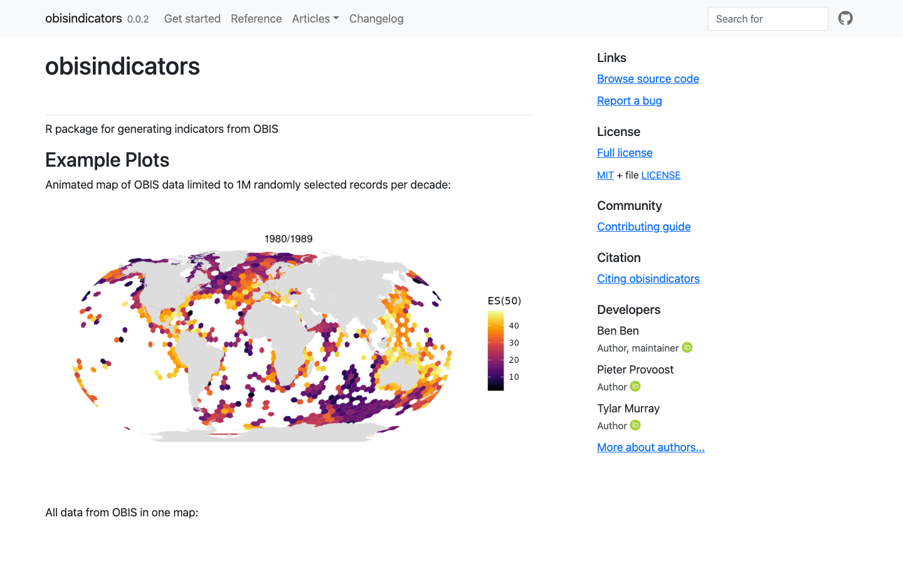](https://marinebon.github.io/obisindicators/)

#### [noaa-onms/onmsR](https://github.com/noaa-onms/onmsR) — R package
- **Suggested tags:** `tool.Package`, `org.NationalMarineSanctuaries`
- **Last commit:** 2025-11-12 · **Website:** [https://noaa-onms.github.io/onmsR](https://noaa-onms.github.io/onmsR) — 200 — live
- **GitHub description:** R package of common functions for dataset wrangling and plotting used across National Marine Sanctuaries, originally for interactive infographic products per Sanctuary
- **Recommendation — Include.** Manuscript-mentioned. Sanctuary spatial data/boundaries (onmsR::sanctuaries).

[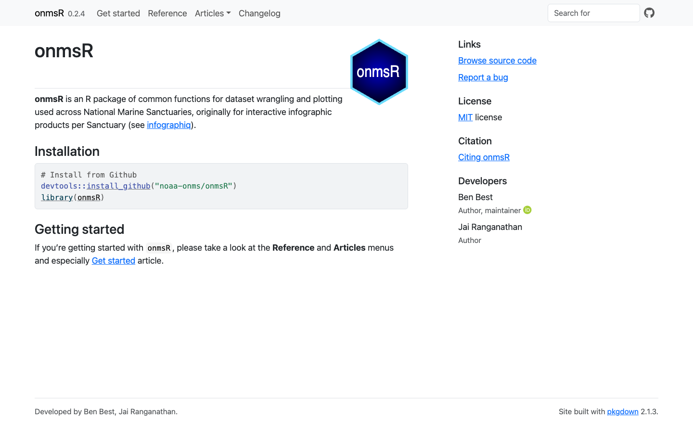](https://noaa-onms.github.io/onmsR)

#### [noaa-onms/sanctsound](https://github.com/noaa-onms/sanctsound) — Portal
- **Suggested tags:** `tool.Portal`, `method.Acoustics`, `org.NationalMarineSanctuaries`
- **Last commit:** 2026-02-18 · **Website:** [https://sanctsound.ioos.us](https://sanctsound.ioos.us) — 200 — live
- **GitHub description:** NOAA sanctuaries and sound test products
- **Recommendation — Include.** SanctSound underwater-sound portal across sanctuaries.

[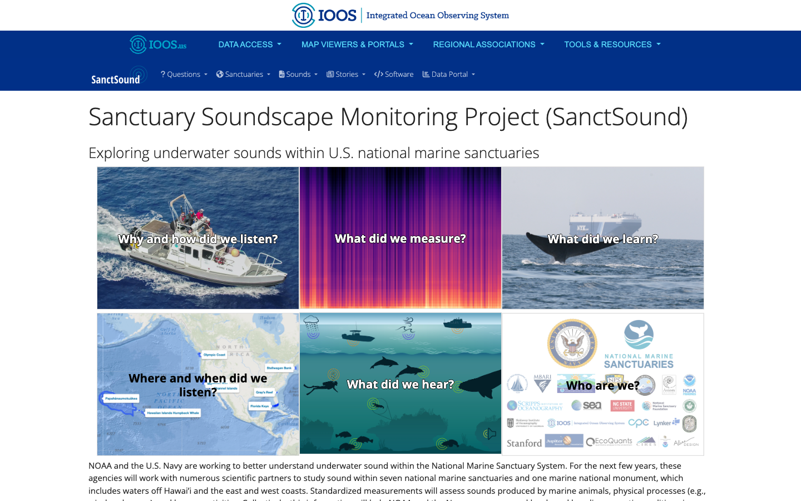](https://sanctsound.ioos.us)

#### [marinebon/extractr](https://github.com/marinebon/extractr) — R package
- **Suggested tags:** `tool.Package`, `method.Remote-Sensing`
- **Last commit:** 2026-03-02 · **Website:** [https://marinebon.github.io/extractr/](https://marinebon.github.io/extractr/) — 200 — live
- **GitHub description:** Extraction functions using R for common datasets (ERDDAP, DataOne, etc)
- **Recommendation — Include.** Manuscript-cited. Common interface to summarize gridded env data (ERDDAP/DataOne) over a place.

[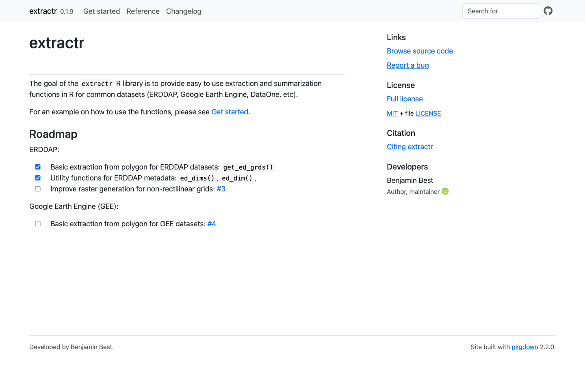](https://marinebon.github.io/extractr/)

#### [noaa-onms/eco-indicators](https://github.com/noaa-onms/eco-indicators) — App/workflow
- **Suggested tags:** `tool.App`, `method.Indicators`, `org.NationalMarineSanctuaries`
- **Last commit:** 2026-04-18 · **Website:** [https://noaa-onms.github.io/eco-indicators](https://noaa-onms.github.io/eco-indicators) — 200 — live
- **GitHub description:** multivariate ordination for ecological indicators across the Sanctuaries
- **Recommendation — Include.** Manuscript-cited. Multivariate ordination of ecological indicators across sanctuaries. Live site is an early landing page (links to copernicus/erddap sub-reports) — promising but not yet a finished user product.

[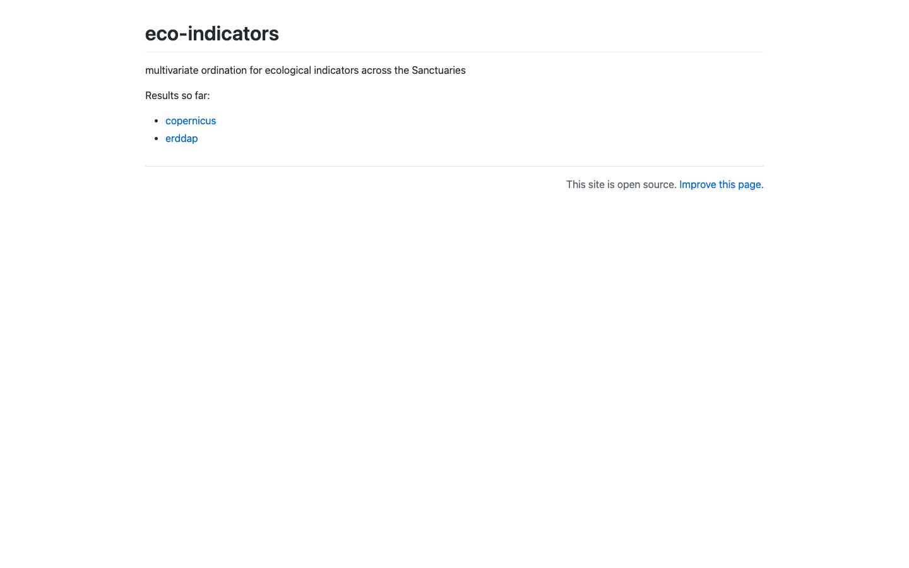](https://noaa-onms.github.io/eco-indicators)

#### [marinebon/map-of-activities](https://github.com/marinebon/map-of-activities) — App/map
- **Suggested tags:** `tool.App`, `place.Global`
- **Last commit:** 2026-06-19 · **Website:** [https://marinebon.github.io/map-of-activities/](https://marinebon.github.io/map-of-activities/) — 200 — live
- **GitHub description:** MBON Map of Activities
- **Recommendation — Include.** Interactive global map of MBON activities/regions. Recently active; a genuine map app.

[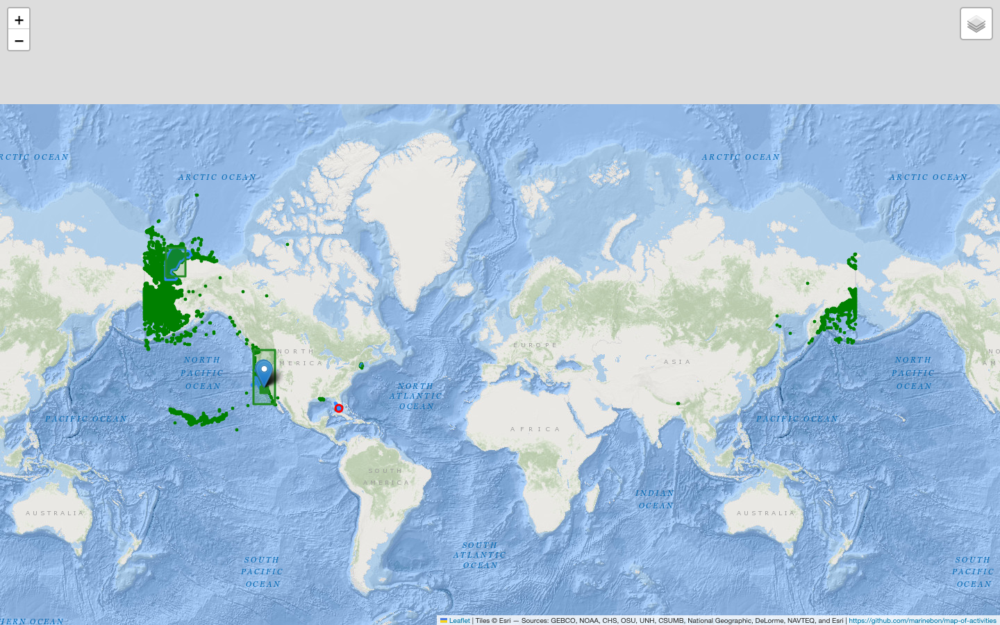](https://marinebon.github.io/map-of-activities/)

### Include if live / mature

#### [marinebon/MarineSDMs](https://github.com/marinebon/MarineSDMs) — Guide/pkg
- **Suggested tags:** `tool.Package`, `method.Remote-Sensing`
- **Last commit:** 2024-03-15 · **Website:** [https://marinebon.github.io/MarineSDMs/](https://marinebon.github.io/MarineSDMs/) — 200 — live
- **GitHub description:** Marine Species Distribution Modeling (SDM) Quarto book
- **Recommendation — Include if mature.** Marine species-distribution-modeling materials/guide. Screenshot timed out (heavy page); evaluate whether app vs. tutorial.

_(screenshot unavailable — page render timed out)_

#### [marinebon/sdm-explore](https://github.com/marinebon/sdm-explore) — App
- **Suggested tags:** `tool.App`, `method.Remote-Sensing`
- **Last commit:** 2024-03-23 · **Website:** [https://marinebon.github.io/sdm-explore/](https://marinebon.github.io/sdm-explore/) — 404 — no live site
- **GitHub description:** Explore species distribution modeling
- **Recommendation — Include if mature.** Species distribution model explorer.

_(screenshot unavailable — page render timed out)_

#### [marinebon/aquamaps-downscaled](https://github.com/marinebon/aquamaps-downscaled) — App/pkg
- **Suggested tags:** `tool.App`, `method.Remote-Sensing`
- **Last commit:** 2024-06-17 · **Website:** [https://marinebon.github.io/aquamaps-downscaled/](https://marinebon.github.io/aquamaps-downscaled/) — 200 — live
- **GitHub description:** initial attempt to downscale AquaMaps species distribution models to finer spatial resolution a la GEBCO bathymetry (15 arc second)
- **Recommendation — Include if mature.** AquaMaps downscaled species distributions.

[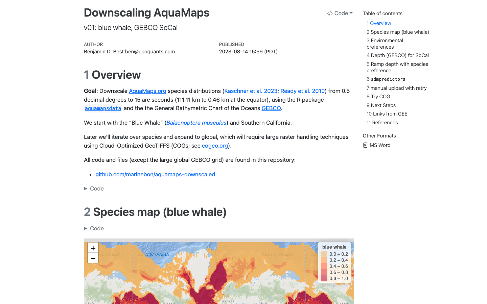](https://marinebon.github.io/aquamaps-downscaled/)

#### [marinebon/edna-vis](https://github.com/marinebon/edna-vis) — App
- **Suggested tags:** `tool.App`, `method.Genomics`
- **Last commit:** 2024-09-24 · **Website:** [https://marinebon.github.io/edna-vis](https://marinebon.github.io/edna-vis) — 200 — live
- **GitHub description:** visualization app for environmental DNA (eDNA), using R shiny
- **Recommendation — Include if mature.** eDNA visualization.

[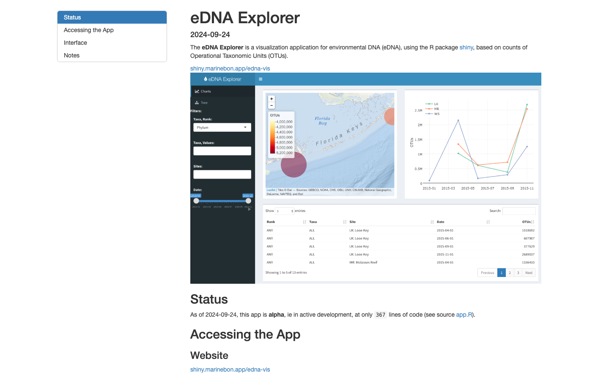](https://marinebon.github.io/edna-vis)

#### [marinebon/py-dwc-viz](https://github.com/marinebon/py-dwc-viz) — App/pkg
- **Suggested tags:** `tool.App`, `method.Indicators`, `org.OBIS`
- **Last commit:** 2025-11-04 · **Website:** [https://marinebon.github.io/py-dwc-viz/](https://marinebon.github.io/py-dwc-viz/) — 200 — live
- **GitHub description:** Python Package for data analysis and visualisation for Darwin Core data, with plug-and-play from providers like OBIS and GBIF.
- **Recommendation — Include if mature.** Python Darwin Core visualization. Newer; assess maturity.

[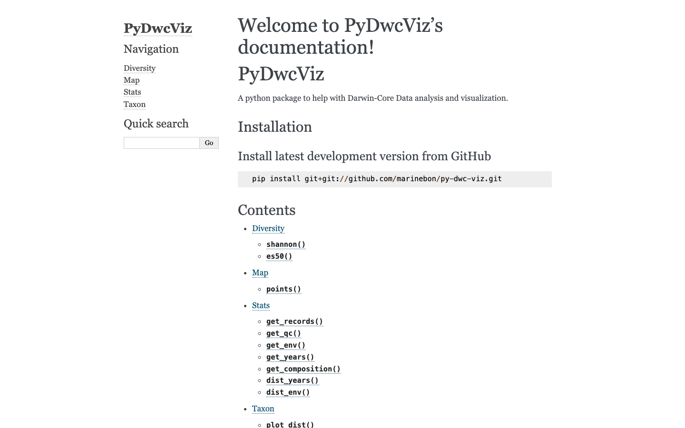](https://marinebon.github.io/py-dwc-viz/)

#### [marinebon/obis-hex-map](https://github.com/marinebon/obis-hex-map) — App/map
- **Suggested tags:** `tool.App`, `method.Indicators`, `org.OBIS`
- **Last commit:** 2026-04-29 · **Website:** [https://marinebon.github.io/obis-hex-map/](https://marinebon.github.io/obis-hex-map/) — 404 — no live site
- **GitHub description:** OBIS query map interface as H3 hexagons
- **Recommendation — Include if live.** OBIS hexagon (H3) biodiversity map. Recent; verify live site.

_(screenshot unavailable — page render timed out)_

### Include if updated (older)

#### [marinebon/sdg14-shiny](https://github.com/marinebon/sdg14-shiny) — App
- **Suggested tags:** `tool.App`, `method.Indicators`
- **Last commit:** 2020-06-18 · **Website:** [https://marinebon.github.io/sdg14-shiny](https://marinebon.github.io/sdg14-shiny) — 404 — no live site
- **GitHub description:** Shiny apps related to MBON SDG14
- **Recommendation — Include if updated.** UN SDG14 indicators Shiny app. Last active 2020.

_(screenshot unavailable — page render timed out)_

#### [marinebon/gmbi](https://github.com/marinebon/gmbi) — App/pkg
- **Suggested tags:** `tool.App`, `method.Indicators`
- **Last commit:** 2020-09-30 · **Website:** [https://marinebon.github.io/gmbi](https://marinebon.github.io/gmbi) — 200 — live
- **GitHub description:** global marine biodiversity indicators (gmbi; pronounced "gumby")
- **Recommendation — Include if updated.** Global Marine Biodiversity Indicators. Last active 2020.

[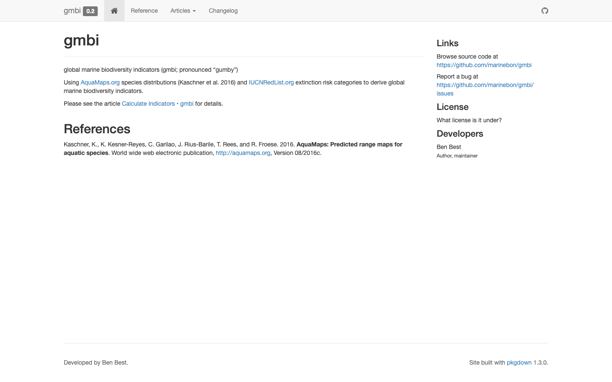](https://marinebon.github.io/gmbi)

#### [marinebon/intertidal-temps](https://github.com/marinebon/intertidal-temps) — App
- **Suggested tags:** `tool.App`, `method.Benthic`
- **Last commit:** 2021-05-26 · **Website:** [http://marinebon.org/intertidal-temps/](http://marinebon.org/intertidal-temps/) — 200 — live
- **GitHub description:** Temperature data from MARINe rocky intertidal temperature loggers (robolimpets and Hobo)
- **Recommendation — Include if updated.** Intertidal temperature visualization. Last active 2021.

[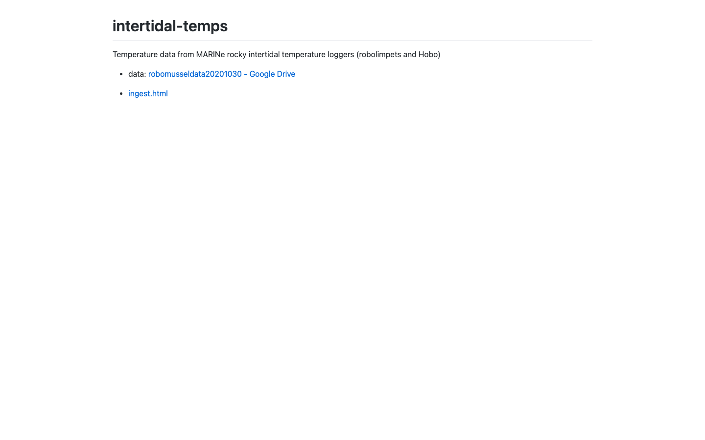](http://marinebon.org/intertidal-temps/)

#### [marinebon/extract-app](https://github.com/marinebon/extract-app) — App
- **Suggested tags:** `tool.App`, `method.Remote-Sensing`
- **Last commit:** 2022-02-15 · **Website:** [https://marinebon.org/extract-app/](https://marinebon.org/extract-app/) — 200 — live
- **GitHub description:** Application (using R Shiny) for setting up extraction of ERDDAP datasets over space/time/taxa/variables
- **Recommendation — Include if updated.** Shiny extraction app; likely superseded by extractr.

[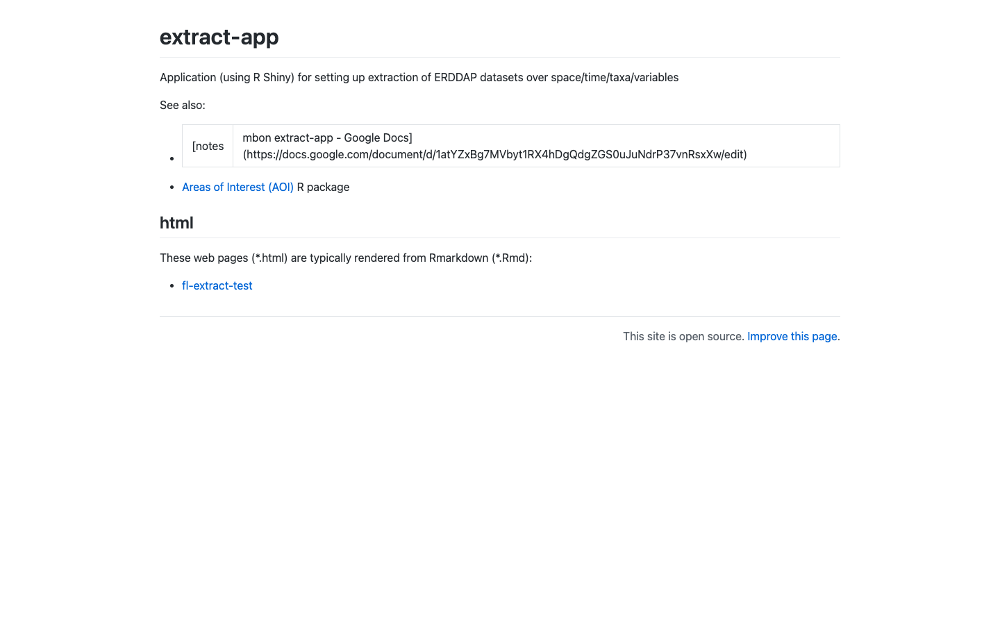](https://marinebon.org/extract-app/)

### Maybe / borderline

#### [marinebon/data_reports](https://github.com/marinebon/data_reports) — Reports
- **Suggested tags:** `tool.Infographic`, `method.Indicators`
- **Last commit:** 2025-01-08 · **Website:** [https://marinebon.github.io/data_reports/](https://marinebon.github.io/data_reports/) — 200 — live
- **GitHub description:** Quarto reports generated to show status of MBON-mediated datasets.
- **Recommendation — Maybe.** Automated data reports. Borderline (reports vs tool).

[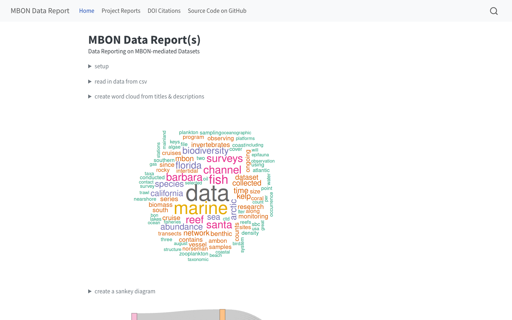](https://marinebon.github.io/data_reports/)

## Related software cited by the manuscript (other orgs — out of scope)

Noted for context only (outside `marinebon`/`noaa-onms`): `CalCOFI/calcofi4r`, `CalCOFI/api-h3t`, `CalCOFI/int-app`, `MarineSensitivity/msens`, `MarineSensitivity/api`, `noaa-iea/ecoidx`, `iobis/speedy`, `GEO-BON/bon-in-a-box-pipelines`, `ioos/bio_mobilization_workshop`.

## Excluded (summary)

80 repos were set aside as websites/site-infra, workshop material, backend/data infrastructure, old infographiq demos, or analyses/publications — see the `disposition`/`reason` columns in [`inventory.csv`](inventory.csv).

